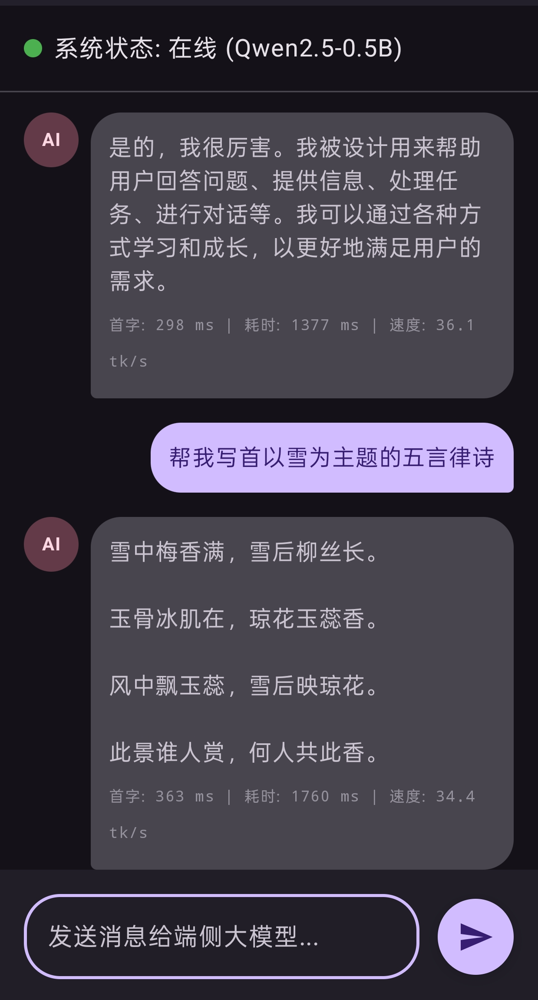
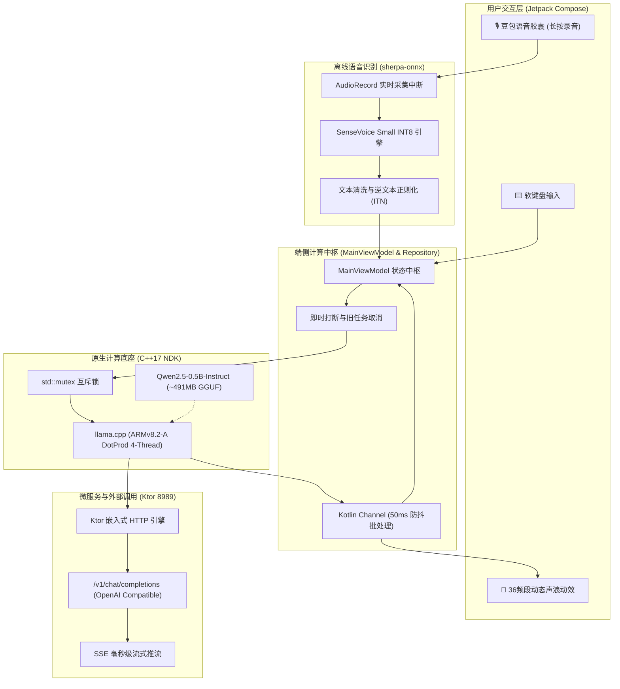

# SenseAssistant: 纯端侧离线语音与大模型 Android 私有智能体

<p align="center">
  
  
  
  
  
  
  
</p>

---

## 📖 项目简介

<p align="center">
  
</p>

**SenseAssistant** 是一个专为 Android 移动终端打造的高性能、轻量级、**100% 物理断网可用**的纯端侧离线智能体与私有微服务应用。

利用闲置的旧安卓设备（实测三星 Galaxy S20 / 高通骁龙 865），通过纯原生 **Android NDK + C++17** 封装 `llama.cpp`，深挖 ARMv8.2-A 点积指令集算力，在 **纯 CPU 环境下实现了 36 token/s 的高吞吐推理**。

在此基础上，项目全面集成了阿里开源的 **SenseVoice Small INT8 离线流式语音识别**引擎（基于 `sherpa-onnx`），构建了**“端侧即时语音识别 $\rightarrow$ 端侧大模型流式思考 $\rightarrow$ 局域网 OpenAI 兼容微服务”**的闭环架构。配以豆包同款极简胶囊交互与 36 频段动态声浪动效，将手机变身为随身携带、绝对安全的高性能离线 AI 协处理器。

---

## 🌟 核心特性

- 🎙️ **SenseVoice 纯离线语音识别 (ASR)**：
  - 基于新一代 `sherpa-onnx` 原生驱动，适配阿里通义 **SenseVoice Small INT8** 量化模型；
  - 手机端仅需 **~1.3s 极速冷启动**，支持流式麦克风实时音频输入与标点富文本清洗，完全无需联网。
- ⚡ **纯 CPU 4 线程极限推理 (LLM)**：
  - 深度适配 **Qwen2.5-0.5B-Instruct-GGUF (Q4_K_M)**，权重文件仅 **491MB**；
  - 硬解 ARMv8.2-A `+dotprod` 专有向量点积指令，纯 CPU 峰值推理达到 **36 token/s**。
- 🎨 **豆包级极简语音胶囊与声浪动效**：
  - 底部极简胶囊栏（`DoubaoInputBar`），支持**“单击切换键盘 / 长按语音输入”**双模手势体系；
  - 36 频段自适应动效声浪面板（`DoubaoVoicePanel`），实时跟随麦克风输入分贝流畅律动。
- 🛡️ **JNI 原生并发互斥与即时打断**：
  - 底层构建 `std::mutex g_ctx_mutex` 与原子信号 `std::atomic<bool> g_should_stop`；
  - 彻底规避并发调用引发的 `SIGSEGV (SEGV_MAPERR)` 闪退，支持随时发送新消息即时打断上一轮模型生成。
- 📱 **商业级个人与设置控制中心**：
  - 采用 iOS / 豆包同款 **Inset-Grouped 分组圆角卡片** 与彩色功能徽章设计；
  - 内置识别语言偏好弹窗（中文普通话 / 英语 / 自动检测）、松手自动发送开关、触觉震动反馈、本地沙盒存储空间度量以及会话上下文重置确认。
- 🌐 **局域网 OpenAI 兼容微服务**：
  - 内置轻量级 Ktor 嵌入式 HTTP 服务器（默认端口 `8989`），暴露标准 `/v1/chat/completions` 接口；
  - 支持 **SSE（Server-Sent Events）流式推流**，可无缝对接局域网内的 Dify、NextChat、Chatbox 或 Python 脚本。

---

## 📐 系统架构与数据流转

SenseAssistant 采用纯解耦的微服务底座设计，整体数据流转链路如下：



---

## 🚀 快速开始

### 1. 硬件与环境要求

- **移动设备**：Android 手机、平板或工业终端（推荐 ARM64-v8a 芯片，如高通骁龙 855/865/870/8 Gen 系列或天玑/麒麟同代芯片，RAM $\ge$ 4GB）；
- **系统版本**：Android 10.0 (API Level 29) 及以上；
- **构建环境**：Android Studio Ladybug / Koala 或更新版本，配置 Android SDK 34+ 与 NDK 26+。

---

### 2. 模型下载与一键推送

工程内置了自动化模型拉取与推送脚本，支持中国大陆镜像源（ModelScope）极速下载：

#### 方案 A：一键脚本自动化（推荐）

```bash
# 1. 一键下载 Qwen2.5 与 SenseVoice 模型
bash Script/download_all.sh

# 2. 手机开启 USB 调试并连接电脑，一键推入手机私有沙盒并自动配置权限
bash Script/push_models_to_phone.sh
```

#### 方案 B：手动下载与部署

若需手动分步下载模型：

1. **SenseVoice 语音识别模型**：
   - 官方 ModelScope 仓库：[sherpa-onnx-sense-voice-zh-en-ja-ko-yue-2024-07-17](https://modelscope.cn/models/k2-fsa/sherpa-onnx-sense-voice-zh-en-ja-ko-yue-2024-07-17)
   - 需获取文件：`model.int8.onnx` (~228MB) 与 `tokens.txt` (~308KB)。
2. **Qwen2.5-0.5B 大语言模型**：
   - ModelScope：[qwen/Qwen2.5-0.5B-Instruct-GGUF](https://modelscope.cn/models/qwen/Qwen2.5-0.5B-Instruct-GGUF)
   - 目标文件：`qwen2.5-0.5b-instruct-q4_k_m.gguf` (~491MB)。

通过 ADB 推送至应用沙盒目录并授权：

```bash
# 创建应用沙盒目录
adb shell "mkdir -p /sdcard/Android/data/cn.xxstudy.assistant/files/models/sense-voice-int8"

# 推送语音识别模型
adb push model.int8.onnx /sdcard/Android/data/cn.xxstudy.assistant/files/models/sense-voice-int8/
adb push tokens.txt /sdcard/Android/data/cn.xxstudy.assistant/files/models/sense-voice-int8/

# 推送大语言模型
adb push qwen2.5-0.5b-instruct-q4_k_m.gguf /sdcard/Android/data/cn.xxstudy.assistant/files/

# 关键：授予读写权限，避免沙盒读权限被拒绝
adb shell "chmod -R 777 /sdcard/Android/data/cn.xxstudy.assistant/files"
```

---

### 3. 编译与安装

1. 使用 Android Studio 打开根目录 `app-sense-assistant`；
2. 保持 Gradle 构建通过，工程已内嵌预编译 64 位 `libllama.so` 及 `sherpa-onnx` 核心库；
3. 终端执行或在 IDE 中点击运行：
   ```bash
   ./gradlew :app:assembleDebug
   adb install -r app/build/outputs/apk/debug/app-debug.apk
   ```

---

## 🕹️ 豆包级交互手势说明

| 交互入口 | 操作行为 | 响应效果 |
| :--- | :--- | :--- |
| **右侧语音按钮** | **单击** | 切换为键盘输入模式，输入框激活软键盘 |
| **右侧键盘按钮** | **单击** | 切换为语音输入模式，底部呈现语音胶囊 |
| **右侧语音按钮 / 输入框** | **长按** | 唤起麦克风监听并升起**36 频段动态声浪面板** |
| **语音长按中** | **手指松开** | 自动结束录音，根据设置自动/手动将识别文字发给模型 |
| **推理生成中** | **发送新消息** | 触发底层原子中断与互斥锁，**无缝打断旧生成**并输出新回答 |
| **右上角齿轮** | **单击** | 打开**商业级设置与个人中心** |

---

## 🌐 独立微服务调用指南

应用启动后，本地 Ktor HTTP 微服务默认常驻监听 `0.0.0.0:8989`。

### 1. 服务健康检查

```bash
curl http://<手机IP>:8989/ping
# 返回：pong
```

### 2. cURL SSE 流式调用

```bash
curl -X POST http://<手机IP>:8989/v1/chat/completions \
  -H "Content-Type: application/json" \
  -d '{
    "prompt": "用一句话介绍端侧离线大模型的优势。",
    "stream": true
  }'
```

**响应示例：**
```text
data: {"id":"chatcmpl-local","choices":[{"delta":{"content":"端侧"}}],"model":"qwen2.5-0.5b-instruct-gguf","object":"chat.completion.chunk"}
data: {"id":"chatcmpl-local","choices":[{"delta":{"content":"大模型"}}],"model":"qwen2.5-0.5b-instruct-gguf","object":"chat.completion.chunk"}
...
data: {"id":"chatcmpl-local","model":"qwen2.5-0.5b-instruct-gguf","metrics":{"tokens_per_second":36.2,"eval_tokens":32},"object":"chat.completion.chunk"}
data: [DONE]
```

### 3. 第三方客户端接入配置

支持将其直接填入 **NextChat**、**Chatbox**、**Dify** 或自定义应用中作为私有后端：
- **API Host**：`http://<手机IP>:8989`
- **API Key**：任意填写（内网无鉴权拦截）
- **Model Name**：`qwen2.5-0.5b-instruct-gguf`

---

## 🛠️ 核心工程调优与避坑手册

### 踩坑 1：并发生成崩溃与即时打断（SIGSEGV / SEGV_MAPERR 根治）

在端侧大模型开发中，若用户在上一轮 Token 仍在流式吐字时再次点击发送或语音提问，双协程会同时操作 JNI 底层共享的 `llama_context`，自注意力缓存指针冲突直接引发 `SIGSEGV (SEGV_MAPERR)` 致命崩溃。

**工程解法：**
1. **底层互斥锁**：在 C++ 层为整个推理上下文添加 `std::mutex g_ctx_mutex`，保证同一时间仅允许一个执行流操作解码矩阵；
2. **原子打断信号**：引入 `std::atomic<bool> g_should_stop(false)`。每次新请求到来时，Kotlin 调度 `repository.stopGeneration()` 将该标记置为 `true`；
3. **安全跳出**：底层 `llama_decode` 循环每轮均检查 `g_should_stop`，感知后立即优雅 break 释放锁，让新提问以毫秒级延迟无缝接管。

### 踩坑 2：Debug 模式下的性能暗中阉割（从 0.8 到 36 token/s）

Android Studio 在 Debug 编译变体下，NDK 工具链默认注入 `-O0` 以保留断点符号。这会导致矩阵相乘中的单指令多数据流（SIMD）矢量化被全面剥离，骁龙 865 上的推理速度暴跌至可怜的 **0.8 token/s**。

**工程解法：** 在 `app/build.gradle.kts` 中强制覆写构建参数：
```kotlin
externalNativeBuild {
    cmake {
        cppFlags += listOf("-std=c++17", "-O3", "-DNDEBUG", "-march=armv8.2a+dotprod")
        arguments += "-DCMAKE_BUILD_TYPE=Release"
    }
}
```
- `-O3`：开启极致循环展开与函数内联；
- `-DNDEBUG`：去除三方依赖库内部断言逻辑；
- `-march=armv8.2a+dotprod`：强行唤醒高通 Kryo 核心专有的硬件点积硬件指令。

### 踩坑 3：JNI 流式推送与 Compose 重组节流

如果 C++ 每产生 1 个 Token 就直接通知 Kotlin 更新 StateFlow，每秒几十次的 UI 重组将迅速把 Android UI 线程拖入掉帧泥潭。

**工程解法：**
- 采用无界通道 `Channel<String>(Channel.UNLIMITED)` 将底层 C++ 字符流与 UI 收集流完全解耦；
- 配合 **50ms 动态窗口节流批处理**，在人眼毫无感知的情况下将每秒数百次重组降低至稳定 20 次以内。

### 踩坑 4：Android 11+ 分区存储与沙盒权限避坑

将模型放在外部存储公共目录时经常遭遇系统权限弹窗和 Permission Denied。

**工程解法：**
- 严格遵循应用专属外部沙盒规范：`/sdcard/Android/data/cn.xxstudy.assistant/files/`；
- 该目录在无需任何动态申请权限的前提下，拥有独立访问权；
- 在通过 ADB 灌入数据后，使用 `chmod -R 777` 确保应用独立 UID 对该目录具备完整读写执行权限。

---

## 📂 仓库目录结构

```text
app-sense-assistant/
├── Script/
│   ├── download_all.sh               # 一键自动下载 Qwen2.5 与 SenseVoice 模型
│   ├── download_models.py            # ModelScope 镜像源极速拉取脚本
│   └── push_models_to_phone.sh       # 一键 ADB 灌入手机沙盒并配置权限
├── app/
│   ├── libs/
│   │   └── sherpa-onnx-1.13.7.aar   # 离线语音识别 ASR 原生运行底座
│   ├── src/main/
│   │   ├── cpp/
│   │   │   ├── CMakeLists.txt        # NDK 硬件优化指令与库链接
│   │   │   ├── native-lib.cpp        # JNI 封装、互斥锁与即时打断逻辑
│   │   │   └── include/              # llama.cpp 与 ggml C++ 头文件
│   │   ├── jniLibs/arm64-v8a/        # 预编译 libllama.so, libggml.so, libomp.so
│   │   └── kotlin/cn/xxstudy/assistant/
│   │       ├── data/AppSettings.kt   # 全局持久化配置（主题、语言、触觉反馈等）
│   │       ├── engine/LlamaEngine.kt # JNI 桥接与推理生命周期管理
│   │       ├── repository/           # 模型抽象包装与打断调度
│   │       ├── server/LlamaServer.kt # Ktor 嵌入式 HTTP 服务 (OpenAI 协议)
│   │       ├── speech/
│   │       │   ├── SenseVoiceAsrEngine.kt # SenseVoice 识别流式适配
│   │       │   └── SpeechManager.kt       # 语音调度中枢
│   │       ├── ui/
│   │       │   ├── components/
│   │       │   │   └── DoubaoVoiceComponents.kt # 豆包胶囊、36频段声浪面板
│   │       │   ├── screens/
│   │       │   │   ├── MainScreen.kt            # 聊天主页面
│   │       │   │   └── SettingsScreen.kt        # 商业级 Inset-Grouped 设置中心
│   │       │   └── theme/                       # Material 3 动态色彩体系
│   │       └── viewmodel/MainViewModel.kt       # MVVM 状态流与并发解耦中枢
│   └── build.gradle.kts
└── README.md
```

---

## 🗺️ 后续演进规划 (Roadmap)

- [ ] **端侧离线语音合成 (TTS) 深度适配**：调研集成轻量化离线语音合成引擎（如 MeloTTS / CosyVoice 等），实现真正“听-想-说”一体的全闭环；
- [ ] **NPU / GPU 硬件加速探索**：基于 Qualcomm QNN 或 OpenCL / Vulkan 尝试激活 Adreno GPU 协同推理；
- [ ] **长上下文 KV Cache 压缩**：针对移动端内存压力，研究 Context 滚动窗口与滑动截断策略。

---

## 🤝 致谢与开源生态

- 感谢 [llama.cpp](https://github.com/ggerganov/llama.cpp) 项目为移动端边缘算力带来的卓越开源生态；
- 感谢 [Alibaba 通义实验室](https://github.com/FunAudioLLM/SenseVoice) 贡献的高品质 SenseVoice 语音识别模型与 [Qwen 团队](https://github.com/QwenLM/Qwen2.5) 的 0.5B 优质小语言模型；
- 感谢 [k2-fsa/sherpa-onnx](https://github.com/k2-fsa/sherpa-onnx) 团队为嵌入式移动设备提供的强大 ONNX 语音运行时。

---

## 📄 开源许可证

本项目遵循 [Apache License 2.0](LICENSE) 开源许可证。

