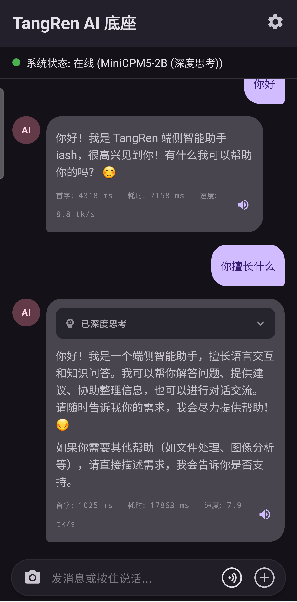
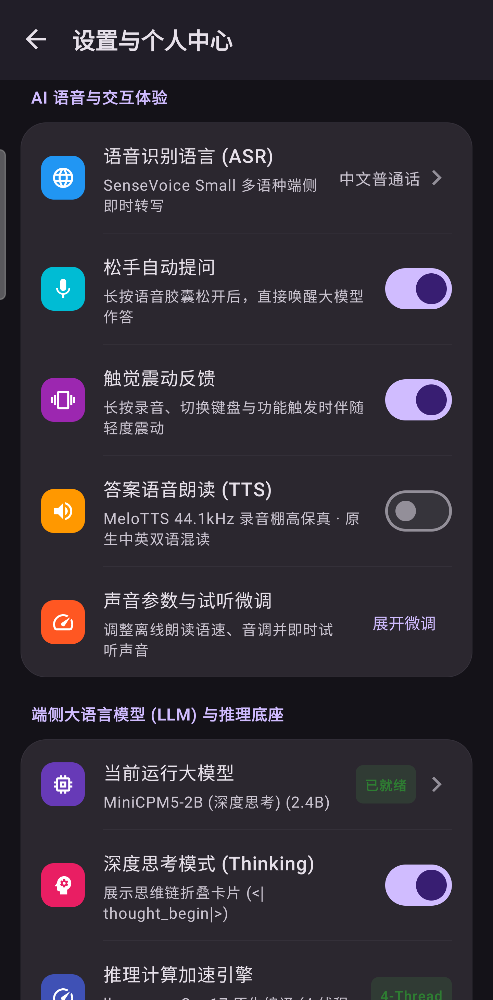
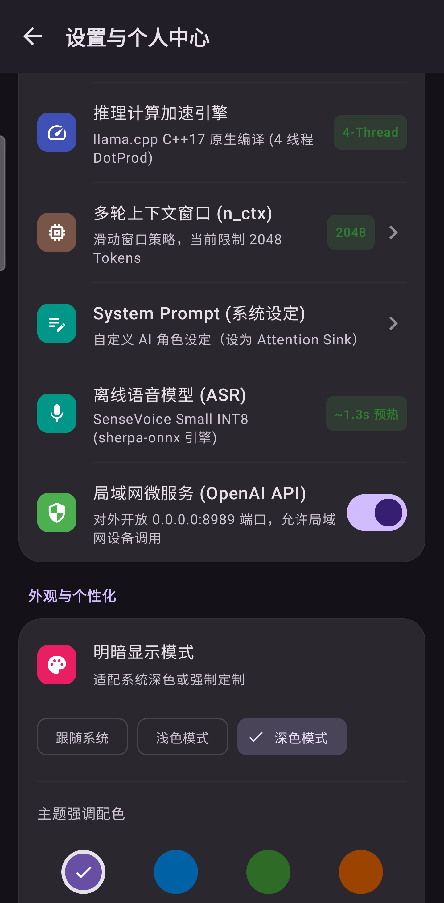
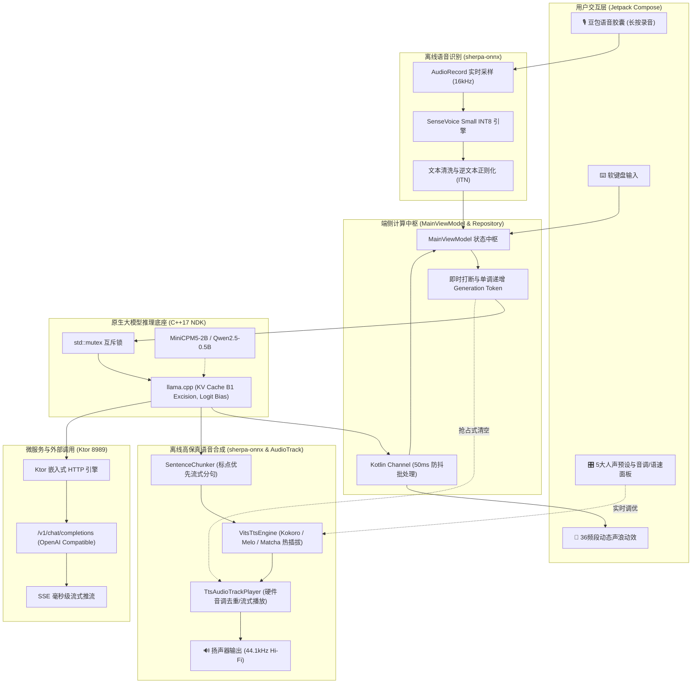

# SenseAssistant: 纯端侧离线语音与大模型 Android 私有智能体

<p align="center">
  
  
  
  
  
  
  
  
</p>

---

## 📖 项目简介

<p align="center">
  
  &nbsp;&nbsp;
  
  &nbsp;&nbsp;
  
</p>

**SenseAssistant** 是一个专为 Android 移动终端打造的高性能、轻量级、**100% 物理断网可用**的纯端侧离线智能体与私有微服务应用。

利用闲置的旧安卓设备（实测三星 Galaxy S20 / 一加 11 / 高通骁龙 865 & 8 Gen 2），通过纯原生 **Android NDK + C++17** 封装 `llama.cpp`，深挖 ARMv8.2-A 点积指令集算力，在 **纯 CPU 环境下实现了 36 token/s 的高吞吐推理**。

在此基础上，项目全面集成了阿里开源的 **SenseVoice Small INT8 离线流式语音识别**引擎与高保真 **MeloTTS 44.1kHz 中英双语离线语音合成**引擎（基于 `sherpa-onnx`），构建了**“端侧即时语音识别 (ASR) $\rightarrow$ 端侧大模型流式思考 (LLM) $\rightarrow$ 端侧高保真语音朗读 (TTS) $\rightarrow$ 局域网 OpenAI 兼容微服务”**的 100% 离线完整闭环架构。配以豆包同款极简胶囊交互、36 频段动态声浪动效与 5 款精调人声预设，将手机变身为随身携带、绝对安全的高性能离线 AI 协处理器。

---

## 🌟 核心特性

- 🎙️ **SenseVoice 纯离线语音识别 (ASR)**：
  - 基于新一代 `sherpa-onnx` 原生驱动，适配阿里通义 **SenseVoice Small INT8** 量化模型；
  - 手机端仅需 **~1.3s 极速冷启动**，支持流式麦克风实时音频输入与标点富文本清洗，完全无需联网。
- ⚡ **深度思考大模型与纯 CPU 极限推理 (LLM)**：
  - 深度适配 **MiniCPM5-2B-Q4_K_M.gguf** (支持自带深度思考链) 以及 **Qwen2.5-0.5B-Instruct-GGUF**，全面拥抱新一代 Reasoning Model 端侧运行；
  - **外科手术式 KV Cache 切除 (B1 算法)**：针对深度思考模型独创的动态显存截断技术，每轮对话后自动从底层 `llama_memory` 中定位 `<|thought_begin|>` 到 `<|thought_end|>` 的索引边界，将冗长的内部思考“记忆”精准切除，彻底根治上下文膨胀与 OOM 问题；
  - **硬件级 Logit Bias 镇压**：当用户在设置中关闭推理思考时，底层引擎会在采样链最前端（`llama_sampler_init_logit_bias`），从物理层面将思考起始符的分布概率强制压制为 `-INFINITY`，突破 RLHF 固化肌肉记忆，实现 100% 确定性的思考阻断；
  - 硬解 ARMv8.2-A `+dotprod` 专有向量点积指令，纯 CPU 峰值推理达到极速吞吐。
- 🔊 **TTS 引擎动态热插拔与离线高保真语音合成**：
  - 基于新一代 `sherpa-onnx` 引擎，支持多种顶级开源 TTS 模型**毫秒级即刻热重载**，告别系统机械发音：
    - **Kokoro-82M**：Transformer 架构的极致拟真王者。仅 82MB 体积却能迸发出带有真实人类呼吸感、断句顿挫与自然情感的中英混读，听感直逼云端大厂收费 API。
    - **Matcha-TTS**：Flow-Matching 纯净极速引擎。极度轻量、不拖泥带水，适合追求极限响应速度的场景（纯中文）。
    - **MeloTTS 44.1kHz**：VITS 架构超清引擎。内置 5 款精调人声预设（御姐/萝莉/书生等），支持语速与音调的独立无级调节。
  - **标点优先流式断句 (Strict Punctuation-First)**：首个逗号/句号即触发音频渲染，日常问候短句仅需 **~640ms 极速出声**，彻底根治长句合成带来的高延迟真空期与中文词组生硬截断；
  - **单调递增 Token 抢占式硬件打断**：底层维护全局原子代数，当发生用户插话（Barge-in）或模型生成新纪元（Generation）时，纳秒级拦截并丢弃即将回流的 PCM 脏数据，同时毫秒级 `flush` 声卡缓冲队列，根绝任何残余语音重叠。
- 🎨 **商业级极简交互与专业 Markdown 渲染引擎**：
  - 底部极简胶囊栏（`DoubaoInputBar`），支持**“单击切换键盘 / 长按语音输入”**双模手势体系；
  - 36 频段自适应动效声浪面板（`DoubaoVoicePanel`），实时跟随麦克风输入分贝流畅律动；
  - 引入了 `compose-richtext` 商业级排版库，支持多级标题、表格、代码块以及深度思考过程的丝滑折叠呈现，并完美自适应 Material 3 动态暗黑主题颜色。
- 🛡️ **JNI 原生并发互斥与即时打断**：
  - 底层构建 `std::mutex g_ctx_mutex` 与原子信号 `std::atomic<bool> g_should_stop`；
  - 彻底规避并发调用引发的 `SIGSEGV (SEGV_MAPERR)` 闪退，支持随时发送新消息即时打断上一轮模型生成与语音播报。
- 📱 **商业级个人与设置控制中心**：
  - 采用 iOS / 豆包同款 **Inset-Grouped 分组圆角卡片** 与彩色功能徽章设计；
  - 内置识别语言偏好弹窗（中文普通话 / 英语 / 自动检测）、TTS 语音播报开关、5 大声音预设切换、语速/音调滑块、松手自动发送开关、触觉震动反馈、本地沙盒存储空间度量以及会话上下文重置确认。
- 🌐 **局域网 OpenAI 兼容微服务**：
  - 内置轻量级 Ktor 嵌入式 HTTP 服务器（默认端口 `8989`），暴露标准 `/v1/chat/completions` 接口；
  - 支持 **SSE（Server-Sent Events）流式推流**，可无缝对接局域网内的 Dify、NextChat、Chatbox 或 Python 脚本。

---

## 📐 系统架构与数据流转

SenseAssistant 采用纯解耦的端侧中枢与微服务底座设计，构建了“听-想-说”全离线闭环，整体数据流转链路如下：



---

## 🚀 快速开始

### 1. 硬件与环境要求

- **移动设备**：Android 手机、平板或工业终端（推荐 ARM64-v8a 芯片，如高通骁龙 855/865/870/8 Gen 系列或天玑/麒麟同代芯片，RAM $\ge$ 4GB）；
- **系统版本**：Android 10.0 (API Level 29) 及以上；
- **构建环境**：Android Studio Ladybug / Koala 或更新版本，配置 Android SDK 34+ 与 NDK 26+。

---

### 2. 模型下载与一键推送

工程内置了自动化模型拉取与推送脚本，支持中国大陆镜像源（ModelScope）极速下载：

#### 方案 A：一键脚本自动化（推荐）

```bash
# 1. 执行一键下载脚本
# 脚本已支持交互式选择，会逐一询问是否需要下载某个模型（默认按回车确认，输入 n 跳过）
# 若想免打扰全部下载，可追加 --yes 参数：bash Script/download_all.sh --yes
bash Script/download_all.sh

# 2. 手机开启 USB 调试并连接电脑，一键推入手机私有沙盒并自动配置权限
bash Script/push_models_to_phone.sh
```

#### 方案 B：手动下载与部署

若需手动分步下载模型：

1. **SenseVoice 语音识别模型**：
   - 官方 ModelScope 仓库：[sherpa-onnx-sense-voice-zh-en-ja-ko-yue-2024-07-17](https://modelscope.cn/models/k2-fsa/sherpa-onnx-sense-voice-zh-en-ja-ko-yue-2024-07-17)
   - 需获取文件：`model.int8.onnx` (~228MB) 与 `tokens.txt` (~308KB)。
2. **深度思考大语言模型 (LLM)**（按需任选一）：
   - **MiniCPM5-2B-Q4_K_M.gguf** (推荐，自带深度思考能力，端侧推理效果震撼)：
     - HuggingFace/ModelScope：[openbmb/MiniCPM5-2B-GGUF](https://huggingface.co/openbmb/MiniCPM5-2B-GGUF)
     - 目标文件：`MiniCPM5-2B-Q4_K_M.gguf` (~1.4GB)
   - **Qwen2.5-0.5B-Instruct-GGUF** (极致轻量化)：
     - ModelScope：[qwen/Qwen2.5-0.5B-Instruct-GGUF](https://modelscope.cn/models/qwen/Qwen2.5-0.5B-Instruct-GGUF)
     - 目标文件：`qwen2.5-0.5b-instruct-q4_k_m.gguf` (~491MB)。
3. **MeloTTS 44.1kHz 中英双语高保真语音合成模型**：
   - 官方发布仓库：[vits-melo-tts-zh_en](https://github.com/k2-fsa/sherpa-onnx/releases/tag/tts-models)
   - 目标文件：`model.onnx` (FP32，推荐性能模式 ~156MB)、`lexicon.txt`、`tokens.txt`、`dict/` 目录及 `*.fst` 规则文件。

通过 ADB 推送至应用沙盒目录并授权：

```bash
# 创建应用沙盒目录
adb shell "mkdir -p /sdcard/Android/data/cn.xxstudy.assistant/files/models/sense-voice-int8"
adb shell "mkdir -p /sdcard/Android/data/cn.xxstudy.assistant/files/models/vits-melo-tts-zh_en"

# 推送语音识别模型
adb push sense-voice-int8/model.int8.onnx /sdcard/Android/data/cn.xxstudy.assistant/files/models/sense-voice-int8/
adb push sense-voice-int8/tokens.txt /sdcard/Android/data/cn.xxstudy.assistant/files/models/sense-voice-int8/

# 推送语音合成模型 (MeloTTS 44.1kHz 完整目录)
adb push vits-melo-tts-zh_en/. /sdcard/Android/data/cn.xxstudy.assistant/files/models/vits-melo-tts-zh_en/

# 推送大语言模型
adb push qwen2.5-0.5b-instruct-q4_k_m.gguf /sdcard/Android/data/cn.xxstudy.assistant/files/

# 关键：授予读写权限，避免沙盒读权限被拒绝
adb shell "chmod -R 777 /sdcard/Android/data/cn.xxstudy.assistant/files"
```

---

### 3. 编译与安装

1. 使用 Android Studio 打开根目录 `app-sense-assistant`；
2. 保持 Gradle 构建通过，工程已内嵌预编译 64 位 `libllama.so` 及 `sherpa-onnx` 核心库；
3. 终端执行或在 IDE 中点击运行：
   ```bash
   ./gradlew :app:assembleDebug
   adb install -r app/build/outputs/apk/debug/app-debug.apk
   ```

---

## 🕹️ 豆包级交互手势说明

| 交互入口 | 操作行为 | 响应效果 |
| :--- | :--- | :--- |
| **右侧语音按钮** | **单击** | 切换为键盘输入模式，输入框激活软键盘 |
| **右侧键盘按钮** | **单击** | 切换为语音输入模式，底部呈现语音胶囊 |
| **右侧语音按钮 / 输入框** | **长按** | 唤起麦克风监听并升起**36 频段动态声浪面板** |
| **语音长按中** | **手指松开** | 自动结束录音，根据设置自动/手动将识别文字发给模型 |
| **推理生成中** | **发送新消息** | 触发底层原子中断与互斥锁，**无缝打断旧生成**并输出新回答 |
| **语音播报中** | **长按录音 / 发送新消息** | 触发单调递增 Generation Token，**纳秒级终止当前音频播放与后台合成** |
| **右上角齿轮** | **单击** | 打开**商业级设置中心**，调节 5 种人声预设、语速/音调滑块、朗读开关与触觉反馈 |

---

## 🌐 独立微服务调用指南

应用启动后，本地 Ktor HTTP 微服务默认常驻监听 `0.0.0.0:8989`。

### 1. 服务健康检查

```bash
curl http://<手机IP>:8989/ping
# 返回：pong
```

### 2. cURL SSE 流式调用

```bash
curl -X POST http://<手机IP>:8989/v1/chat/completions \
  -H "Content-Type: application/json" \
  -d '{
    "prompt": "用一句话介绍端侧离线大模型的优势。",
    "stream": true
  }'
```

**响应示例：**
```text
data: {"id":"chatcmpl-local","choices":[{"delta":{"content":"端侧"}}],"model":"qwen2.5-0.5b-instruct-gguf","object":"chat.completion.chunk"}
data: {"id":"chatcmpl-local","choices":[{"delta":{"content":"大模型"}}],"model":"qwen2.5-0.5b-instruct-gguf","object":"chat.completion.chunk"}
...
data: {"id":"chatcmpl-local","model":"qwen2.5-0.5b-instruct-gguf","metrics":{"tokens_per_second":36.2,"eval_tokens":32},"object":"chat.completion.chunk"}
data: [DONE]
```

### 3. 第三方客户端接入配置

支持将其直接填入 **NextChat**、**Chatbox**、**Dify** 或自定义应用中作为私有后端：
- **API Host**：`http://<手机IP>:8989`
- **API Key**：任意填写（内网无鉴权拦截）
- **Model Name**：`qwen2.5-0.5b-instruct-gguf`

---

## 🛠️ 核心工程调优与避坑手册

### 踩坑 1：并发生成崩溃与即时打断（SIGSEGV / SEGV_MAPERR 根治）

在端侧大模型开发中，若用户在上一轮 Token 仍在流式吐字时再次点击发送或语音提问，双协程会同时操作 JNI 底层共享的 `llama_context`，自注意力缓存指针冲突直接引发 `SIGSEGV (SEGV_MAPERR)` 致命崩溃。

**工程解法：**
1. **底层互斥锁**：在 C++ 层为整个推理上下文添加 `std::mutex g_ctx_mutex`，保证同一时间仅允许一个执行流操作解码矩阵；
2. **原子打断信号**：引入 `std::atomic<bool> g_should_stop(false)`。每次新请求到来时，Kotlin 调度 `repository.stopGeneration()` 将该标记置为 `true`；
3. **安全跳出**：底层 `llama_decode` 循环每轮均检查 `g_should_stop`，感知后立即优雅 break 释放锁，让新提问以毫秒级延迟无缝接管。

### 踩坑 2：Debug 模式下的性能暗中阉割（从 0.8 到 36 token/s）

Android Studio 在 Debug 编译变体下，NDK 工具链默认注入 `-O0` 以保留断点符号。这会导致矩阵相乘中的单指令多数据流（SIMD）矢量化被全面剥离，骁龙 865 上的推理速度暴跌至可怜的 **0.8 token/s**。

**工程解法：** 在 `app/build.gradle.kts` 中强制覆写构建参数：
```kotlin
externalNativeBuild {
    cmake {
        cppFlags += listOf("-std=c++17", "-O3", "-DNDEBUG", "-march=armv8.2a+dotprod")
        arguments += "-DCMAKE_BUILD_TYPE=Release"
    }
}
```
- `-O3`：开启极致循环展开与函数内联；
- `-DNDEBUG`：去除三方依赖库内部断言逻辑；
- `-march=armv8.2a+dotprod`：强行唤醒高通 Kryo 核心专有的硬件点积硬件指令。

### 踩坑 3：JNI 流式推送与 Compose 重组节流

如果 C++ 每产生 1 个 Token 就直接通知 Kotlin 更新 StateFlow，每秒几十次的 UI 重组将迅速把 Android UI 线程拖入掉帧泥潭。

**工程解法：**
- 采用无界通道 `Channel<String>(Channel.UNLIMITED)` 将底层 C++ 字符流与 UI 收集流完全解耦；
- 配合 **50ms 动态窗口节流批处理**，在人眼毫无感知的情况下将每秒数百次重组降低至稳定 20 次以内。

### 踩坑 4：Android 11+ 分区存储与沙盒权限避坑

将模型放在外部存储公共目录时经常遭遇系统权限弹窗和 Permission Denied。

**工程解法：**
- 严格遵循应用专属外部沙盒规范：`/sdcard/Android/data/cn.xxstudy.assistant/files/`；
- 该目录在无需任何动态申请权限的前提下，拥有独立访问权；
- 在通过 ADB 灌入数据后，使用 `chmod -R 777` 确保应用独立 UID 对该目录具备完整读写执行权限。

### 踩坑 5：ARM64 CPU 上的 INT8 量化性能反转与 FP32 NEON SIMD 逆袭 (RTF 1.869 $\rightarrow$ 0.850)

在常规模型工程经验中，量化通常意味着“体积更小、计算更快”。但在端侧移动 CPU 上部署 VITS / MeloTTS 时，这一常识发生了严重的**性能倒挂**：
- **INT8 惨败**：MeloTTS INT8 量化模型（~45MB）在骁龙 8 Gen 2 / 865 上的推理实时率 (RTF) 高达 **1.869**（合成 1 秒音频需耗费 1.87 秒算力）。流式播放时音频消耗速度远快于生产速度，引发严重的 `AudioTrack underrun`，声音断断续续；
- **FP32 逆袭**：采用未量化的 FP32 原始模型（`model.onnx` ~156MB）配合 2 个大核线程后，RTF 骤降至 **0.850**（合成速度比播放速度快 15% 以上），首包合成延迟从 4.2s 骤减至 1.88s，卡顿彻底清零！

**底层机理解析：**
1. **指令集硬件缺位与软解开销**：移动端 ONNX Runtime 的 CPU Execution Provider (CPU EP) 对 INT8 算子缺乏类似 x86 AVX-512 VNNI 的专用硬件加速路径，在 ARM64 上频繁引入密集的动态反量化计算（Dequantize to float32）；
2. **NEON SIMD 矢量化满血发挥**：FP32 浮点计算可 100% 映射至 ARM64 专有的 **NEON 128-bit 向量浮点寄存器**，硬件流水线处于满负荷无阻塞状态；
3. **大小核线程竞争与同步屏障 (Thread Over-Subscription)**：现代移动平台（如骁龙 8 Gen 2 的 1+4+3 架构）若直接开满 4 线程，会导致 OpenMP 屏障同步时高性能超大核/大核必须停机等待 Cortex-A510 低功耗小核。将推理线程数收敛至 **2 个大核线程**，性能反而达到全局最优。

### 踩坑 6：流式分词断句陷阱 —— 从机械字数截断到“标点优先 (Strict Punctuation-First)”策略

大语言模型（LLM）以 Token 流的形式持续吐字，如何将动态字符切片输入 TTS 成为决定延迟与语感的命脉。若采用粗暴的“固定字符长度阈值（如满 10~15 字截断）”：
- **汉语语病**：“大规模”被切成“大 / 规模”，“不仅如此”被切成“不仅 / 如此”，导致分词器（Lexicon）多音字识别崩塌，语调断裂生硬；
- **英文粉碎**：形如 `"You can exchange currencies..."` 的英文被中间斩断成 `"You "` 和 `" exchange..."`，MeloTTS 无法识别残缺词缀直接静音跳过。

**工程解法 —— Strict Punctuation-First（标点优先）策略：**
1. **严格标点触发**：构建 `SentenceChunker`，流式缓存字符，**仅且必须在自然停顿标点**（`，` `。` `！` `？` `、` `；` `.` `!` `?` `,`）处触发切片产出；
2. **首包超低延迟与自然语感兼得**：对于日常问候语（如“您好！请问有什么我可以帮您？”），由于首个标点位于第 2~3 字，TTS 仅需 **644ms** 即可发出第一声！对于长难从句，由于完整保留短语结构，多音字拼音转换准确率达 100%；
3. **紧急防溢出兜底机制**：设定 45 字符（中文）与 120 字符（英文）作为防溢出软上限，仅在模型产生超长无标点极端输出时在空白字符处安全断句。

### 踩坑 7：JNI C++ 非协作式阻塞推理与单调递增 Generation Token 抢占式打断

在语音助手全双工交互中，用户随时可能发起插话（Barge-in）或发送新请求。常规通过 Kotlin 协程 `job.cancel()` 存在严重的滞后性：
- 底层 `sherpa-onnx` 的 JNI C++ 语音合成属于**不可中断的阻塞式系统调用**；
- 哪怕上层协程已被取消，C++ 层仍会将当前整个分句完整计算完毕并返回 PCM 字节数组。若直接丢进音频流，会导致“用户已在提问下一句，上一句的语音残余仍在喋喋不休”。

**工程解法 —— 纳秒级 Generation Token 世代代数校验：**
1. **单调递增代数**：维护全局原子代数 `AtomicLong currentGeneration`，每次用户打断、开始新识别或发送新消息时，调用 `stopSpeaking()` 递增代数：`val token = currentGeneration.incrementAndGet()`；
2. **即时硬件冲刷**：打断瞬间立即对 `AudioTrack` 发起 `pause()` 与 `flush()`，毫秒级清空声卡底层缓冲队列；
3. **回源惰性拦截**：TTS 工作协程在耗时巨大的 JNI C++ 合成返回后，第一时间执行**代数对齐校验**：
   ```kotlin
   val audio = vitsEngine.generate(chunk)
   if (jobGen != currentGeneration.get()) {
       // 发现已被新世代抢占，纳秒级直接丢弃过期 PCM 数据
       return
   }
   ```
   彻底解决了 JNI 原生计算无法被协程直接杀死导致的语音串流、重叠与旧声回响。

### 踩坑 8：AudioTrack 连续写硬件音调去重与缓冲 Underrun 治理

在实现流式连续音频播报时，底层音频通道的操作细节决定了音质的纯净度：
- **音调参数重复写入震荡**：若每个音频 Chunk 到达时都调用 `AudioTrack.setPlaybackParams(pitch)`，会触发 Android HAL 层 `AudioTrack::flush+` 和 `isStopFlush` 的驱动重构，不仅在 logcat 产生大量冗余刷屏，更会在相邻分句交界处引发细微的“咔哒”爆音；
- **分句间断空泡**：若采用单次发声模式（播放完一个 chunk 即 stop），每次重建 AudioTrack 将带来 30~50ms 延迟，句子间听感极度顿挫。

**工程解法：**
1. **硬件音调参数去重缓存**：在 `TtsAudioTrackPlayer` 中加入浮点状态比对 `if (abs(track.playbackParams.pitch - currentPitch) > 0.005f)`，仅在音调发生实质改变时才下发硬件底层；
2. **长连接常驻流式写入**：保持 `AudioTrack(STREAM_MUSIC, 44100Hz, CHANNEL_OUT_MONO, PCM_16BIT, MODE_STREAM)` 处于连续播放状态，多段音频通过线程安全队列平滑喂入；
3. **静默优雅休眠**：仅在所有句子分段均播报完毕且队列为空时，才进入休眠释放 CPU，实现 CD 级高保真（44.1kHz）平滑连贯朗读。

---

## 📂 仓库目录结构

```text
app-sense-assistant/
├── Script/
│   ├── download_all.sh               # 一键自动下载 Qwen2.5, SenseVoice 与 MeloTTS 模型
│   ├── download_models.py            # ModelScope 镜像源极速拉取脚本
│   └── push_models_to_phone.sh       # 一键 ADB 灌入手机沙盒并配置权限
├── app/
│   ├── libs/
│   │   └── sherpa-onnx-1.13.7.aar   # 离线语音识别 ASR 与语音合成 TTS 原生运行底座
│   ├── src/main/
│   │   ├── cpp/
│   │   │   ├── CMakeLists.txt        # NDK 硬件优化指令与库链接
│   │   │   ├── native-lib.cpp        # JNI 封装、互斥锁与即时打断逻辑
│   │   │   └── include/              # llama.cpp 与 ggml C++ 头文件
│   │   ├── jniLibs/arm64-v8a/        # 预编译 libllama.so, libggml.so, libomp.so
│   │   └── kotlin/cn/xxstudy/assistant/
│   │       ├── data/AppSettings.kt   # 全局持久化配置（主题、人声预设、语速、音调等）
│   │       ├── engine/LlamaEngine.kt # JNI 桥接与推理生命周期管理
│   │       ├── repository/           # 模型抽象包装与打断调度
│   │       ├── server/LlamaServer.kt # Ktor 嵌入式 HTTP 服务 (OpenAI 协议)
│   │       ├── speech/
│   │       │   ├── SenseVoiceAsrEngine.kt   # SenseVoice 离线识别流式适配
│   │       │   ├── VitsTtsEngine.kt         # MeloTTS 44.1kHz FP32 离线语音合成引擎
│   │       │   ├── SentenceChunker.kt       # 标点优先 (Strict Punctuation-First) 流式断句器
│   │       │   ├── TtsAudioTrackPlayer.kt   # AudioTrack 44.1kHz 流式低延迟播放与打断
│   │       │   └── SpeechManager.kt         # 全双工语音输入/输出调度中枢
│   │       ├── ui/
│   │       │   ├── components/
│   │       │   │   └── DoubaoVoiceComponents.kt # 豆包胶囊、36频段声浪面板
│   │       │   ├── screens/
│   │       │   │   ├── MainScreen.kt            # 聊天主页面
│   │       │   │   └── SettingsScreen.kt        # 商业级 Inset-Grouped 设置中心
│   │       │   └── theme/                       # Material 3 动态色彩体系
│   │       └── viewmodel/MainViewModel.kt       # MVVM 状态流与并发解耦中枢
│   └── build.gradle.kts
└── README.md
```

---

## 🗺️ 后续演进规划 (Roadmap)

- [x] **端侧离线语音合成 (TTS) 深度适配**：集成 Kokoro, Matcha, MeloTTS 等高保真引擎与多模型热插拔架构，实现“听-想-说”一体的全闭环；
- [ ] **NPU / GPU 硬件加速探索**：基于 Qualcomm QNN 或 OpenCL / Vulkan 尝试激活 Adreno GPU 协同推理；
- [ ] **长上下文 KV Cache 压缩**：针对移动端内存压力，研究 Context 滚动窗口与滑动截断策略。

---

## 🤝 致谢与开源生态

- 感谢 [llama.cpp](https://github.com/ggerganov/llama.cpp) 项目为移动端边缘算力带来的卓越开源生态；
- 感谢 [Alibaba 通义实验室](https://github.com/FunAudioLLM/SenseVoice) 贡献的高品质 SenseVoice 语音识别模型与 [Qwen 团队](https://github.com/QwenLM/Qwen2.5) 的 0.5B 优质小语言模型；
- 感谢 [k2-fsa/sherpa-onnx](https://github.com/k2-fsa/sherpa-onnx) 团队为嵌入式移动设备提供的强大 ONNX 语音识别与合成运行时。

---

## 📄 开源许可证

本项目遵循 [Apache License 2.0](LICENSE) 开源许可证。

