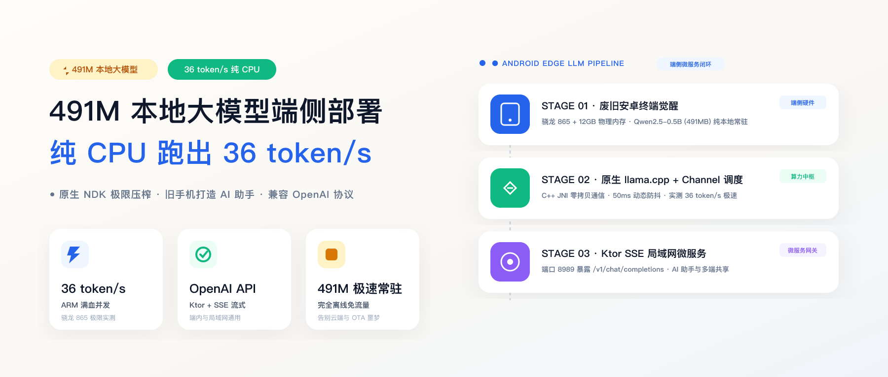
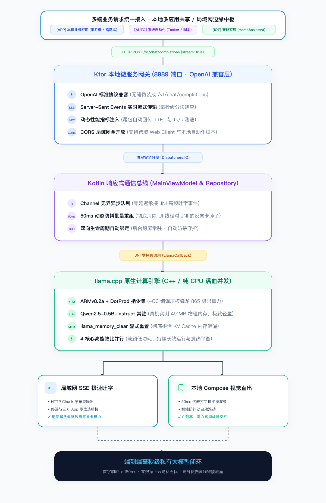

# SenseAssistant: 491M 端侧大模型 Android 私有微服务

<p align="center">
  
</p>

<p align="center">
  
  
  
  
  
  
</p>

---

## 📖 项目简介

<p align="center">
  
</p>

**SenseAssistant** 是一个专为 Android 移动端打造的高性能、轻量化本地大模型底座与私有微服务应用。

利用退役闲置的旧安卓手机（实测三星 Galaxy S20 / 高通骁龙 865），通过纯原生 **Android NDK + C++17** 封装 `llama.cpp`，压榨 ARMv8.2-A 点积指令集硬件算力，在 **纯 CPU 环境下跑出 36 token/s** 的飞速推理。

同时，内置轻量级 **Ktor 嵌入式 HTTP 服务器**，提供标准化 **OpenAI 兼容协议接口** 与 **SSE（Server-Sent Events）毫秒级流式输出**，将手机变身为一台随身携带、物理断网可用、局域网多端共享的私有 AI 协处理器。

---

## 🌟 核心特性

- ⚡ **纯 CPU 极限性能**：在无 NPU 驱动加持的高通骁龙 865 上，纯 CPU 4 线程峰值推理达到 **36 token/s**。
- 📦 **轻量极速甜点位**：适配 **Qwen2.5-0.5B-Instruct-GGUF (Q4_K_M)**，权重文件仅 **491MB**，兼顾高语义理解与毫秒级即时响应。
- 🛡️ **免权限沙盒挂载**：支持直接通过 ADB 灌入 App 私有沙盒，彻底避开 Android 11+ 繁琐的分区存储（Scoped Storage）权限弹窗。
- 🌐 **OpenAI 协议微服务**：内置 Ktor HTTP 服务（默认端口 `8989`），直接暴露 `/v1/chat/completions`，支持 Dify、NextChat、Chatbox、Python 脚本等无缝接入。
- 🌊 **双通道异步流式传输**：JNI 与 UI 之间采用 Kotlin `Channel<String>` 生产消费异步管道，50ms 批量更新防抖，彻底告别界面卡顿。
- 🧩 **预编译解耦架构**：预编译 64 位 `libllama.so` 及底层依赖，无需重新编译庞大的 llama.cpp 源码树，导入 Android Studio 秒级构建。

---

## 📐 系统架构与流转设计

传统方案往往把模型与业务逻辑生硬打包在同一个 APK 内，导致包体积膨胀且 OTA 维护困难。**SenseAssistant 采用微服务底座架构**：

<p align="center">
  
</p>

### 架构优势

1. **业务与模型彻底解耦**：无论是同一台设备上的背单词 App、题目解析工具，还是局域网内的电脑端脚本，都通过标准回环/局域网接口交互。业务发版无需重复分发 491MB 的庞大模型文件。
2. **常驻单例内存共享**：多应用并发或轮询调用时，共享同一份常驻内存，无需为每个 App 单独启动模型实例。
3. **高可用边缘离线闭环**：在教育平板防沉迷断网、医疗设备内网合规、高铁/户外无网等弱网场景下，保障本地离线秒级响应。

---

## 🚀 快速开始

### 1. 硬件与环境要求

- **硬件设备**：Android 手机或平板（推荐 ARM64-v8a 架构芯片，如骁龙 855 / 865 / 870 / 8 Gen 系列，RAM $\ge$ 6GB）；
- **系统版本**：Android 10.0 (API Level 29) 及以上；
- **开发工具**：Android Studio Ladybug / Koala 或更新版本，配置 Android SDK 34+ 和 NDK 26+。

### 2. 下载推荐模型权重

推荐使用阿里开源并量化的 **Qwen2.5-0.5B-Instruct-GGUF (Q4_K_M)**：

- **Hugging Face**：[Qwen/Qwen2.5-0.5B-Instruct-GGUF](https://huggingface.co/Qwen/Qwen2.5-0.5B-Instruct-GGUF)
- **ModelScope**：[qwen/Qwen2.5-0.5B-Instruct-GGUF](https://modelscope.cn/models/qwen/Qwen2.5-0.5B-Instruct-GGUF)
- **目标文件名**：`qwen2.5-0.5b-instruct-q4_k_m.gguf`（大小约 491.4 MB）

### 3. 推送模型到手机沙盒

连接手机并开启 USB 调试，运行以下命令将模型推入应用沙盒目录（无需任何额外权限）：

```bash
# 创建应用外部私有沙盒目录
adb shell mkdir -p /sdcard/Android/data/cn.xxstudy.assistant/files/

# 将模型推入手机
adb push qwen2.5-0.5b-instruct-q4_k_m.gguf /sdcard/Android/data/cn.xxstudy.assistant/files/
```

> **提示**：如果想放置在 App 内部沙盒，也可以直接推入 `/data/data/cn.xxstudy.assistant/files/`。App 内部已实现双路径自适应回退匹配。

### 4. 导入与运行

1. 用 Android Studio 打开工程目录 `app-sense-assistant`；
2. Gradle Sync 完成后，工程已内置 `libllama.so` 预编译动态库与 C++ 声明头文件；
3. 选择连接的真机，点击 **Run 'app'** 即可直接编译安装。

---

## 🌐 独立微服务调用指南

应用启动后，本地 Ktor HTTP 服务默认监听 `0.0.0.0:8989`。

### 1. 健康检查

```bash
curl http://<手机IP>:8989/ping
# 返回：pong
```

### 2. cURL SSE 流式调用

```bash
curl -X POST http://<手机IP>:8989/v1/chat/completions \
  -H "Content-Type: application/json" \
  -d '{
    "prompt": "用一句话解释什么是量子力学？",
    "stream": true
  }'
```

**流式响应示例：**
```text
data: {"id":"chatcmpl-local","choices":[{"delta":{"content":"量子"}}],"model":"qwen2.5-0.5b-instruct-gguf","object":"chat.completion.chunk"}

data: {"id":"chatcmpl-local","choices":[{"delta":{"content":"力学是"}}],"model":"qwen2.5-0.5b-instruct-gguf","object":"chat.completion.chunk"}

...

data: {"id":"chatcmpl-local","model":"qwen2.5-0.5b-instruct-gguf","metrics":{"tokens_per_second":36.2,"eval_tokens":48},"object":"chat.completion.chunk"}

data: [DONE]
```

### 3. Python 脚本调用

```python
import requests
import json

URL = "http://192.168.31.200:8989/v1/chat/completions"

payload = {
    "prompt": "请输出一个快速排序算法的 Python 递归实现。",
    "stream": True
}

response = requests.post(URL, json=payload, stream=True)
for line in response.iter_lines(decode_unicode=True):
    if line and line.startswith("data: "):
        content = line[6:]
        if content == "[DONE]":
            break
        data = json.loads(content)
        choices = data.get("choices", [])
        if choices:
            token = choices[0].get("delta", {}).get("content", "")
            print(token, end="", flush=True)
print()
```

### 4. 第三方客户端接入（NextChat / Chatbox / Dify）

- **API Host**：`http://<手机IP>:8989`
- **API Key**：任意填写（内部未做强制拦截）
- **Model Name**：`qwen2.5-0.5b-instruct-gguf`

---

## 🛠️ 深度工程调优与避坑手册

### 踩坑 1：Debug 模式的暗中阉割（从 0.8 到 36 token/s）

在 Android 原生开发中，Android Studio 在 Debug 变体下为了方便 GDB/LLDB 单步断点调试，默认在 NDK 构建工具链中注入了 `-O0` 参数。

这会导致 C++ 的矩阵乘法循环被强行展开抑制，原本硬件加速的矩阵点乘运算退化为最古老的逐字节单循环，骁龙 865 实测推理只有 **0.8 token/s**。

**解决方案：** 在 `app/build.gradle.kts` 中显式覆写构建参数：

```kotlin
externalNativeBuild {
    cmake {
        // 强制开启 ARM 终极优化指令集，屏蔽 Debug 模式的性能阉割
        cppFlags += listOf("-std=c++17", "-O3", "-DNDEBUG", "-march=armv8.2a+dotprod")
        arguments += "-DCMAKE_BUILD_TYPE=Release"
    }
}
```

* **`-O3`**：激活最高层级的激进编译优化与内联。
* **`-DNDEBUG`**：抹除所有第三方 C++ 库内的冗余断言判定。
* **`-march=armv8.2a+dotprod`**：强行唤醒 ARM Cortex-A77 核心自带的 **Dot Product（点积）向量运算专有硬件指令**。

### 踩坑 2：JNI 跨界调用被 Compose UI 深度拷贝卡死

在流式输出时，如果 C++ 底层每推一个字符就通过 JNI 回调 Kotlin 触发状态变更，Compose 在重组（Recomposition）时若对长文本列表进行频繁状态收集与深拷贝，会导致 UI 线程严重掉帧卡死。

**解决方案：** 建立基于无界通道的生产-消费解耦：
```kotlin
// C++ 线程通过 Channel 快速投递，零阻塞返回
val channel = Channel<String>(Channel.UNLIMITED)

// UI 或网络推送端开启协程批量排空，配合 50ms 窗口动态节流刷新
```

### 踩坑 3：多轮对话 KV Cache 内存泄漏引发算力雪崩

作为独立微服务常驻运行时，如果收到新请求没有显式清空旧的上下文 Memory，上一轮对话遗留的状态会一直堆积在自注意力矩阵中，导致后续提问的 prefill 阶段耗时几何级暴增。

llama.cpp 新版规范已弃用老旧清理接口，需显式调用 Memory 复位：
```cpp
// 每次新请求触发前必须显式复位当前 Context Memory
llama_memory_clear(llama_get_memory(g_ctx), true);
```

### 踩坑 4：移动端温控降频物理法则

移动芯片由于无主动风扇散热，在重度跑满 4 核心（Big Cores）推理 3~5 分钟后，芯片温度上升会触发系统的 Thermal Governor（温控降频）：
* **峰值爆发速度（前 2 分钟）**：**36 token/s**；
* **持续稳态速度（降频后）**：**18 ~ 20 token/s**。

即便在稳态 18 token/s 下，相当于每秒输出 8 到 10 个汉字，依然远超成年人日常阅读和输入速度，完全满足边缘端高吞吐需求。

---

## 📂 仓库目录结构

```text
app-sense-assistant/
├── app/
│   ├── src/
│   │   ├── main/
│   │   │   ├── cpp/
│   │   │   │   ├── CMakeLists.txt        # CMake 构建配置（链接预编译 so）
│   │   │   │   ├── native-lib.cpp        # JNI 核心接口封装与 ChatML 格式化
│   │   │   │   └── include/              # llama.cpp 与 ggml C++ 头文件
│   │   │   ├── jniLibs/
│   │   │   │   └── arm64-v8a/            # 预编译核心加速库（libllama, libggml, libomp）
│   │   │   ├── kotlin/cn/xxstudy/assistant/
│   │   │   │   ├── repository/           # LlamaRepository 本地引擎包装器
│   │   │   │   ├── server/               # LlamaServer（Ktor HTTP 微服务 & SSE）
│   │   │   │   └── ui/                   # Jetpack Compose 界面与 ViewModel
│   │   │   └── AndroidManifest.xml
│   │   └── build.gradle.kts
├── docs/
│   └── images/                           # 架构流转图与视觉物料
└── README.md
```

---

## 🤝 贡献与致谢

- 感谢 [llama.cpp](https://github.com/ggerganov/llama.cpp) 为端侧大模型带来的开创性生态。
- 感谢 [Qwen 团队](https://github.com/QwenLM/Qwen2.5) 贡献的高品质 0.5B 小尺寸开源模型。
- 感谢 [Ktor](https://ktor.io/) 提供的轻量级全异步嵌入式服务端解决方案。

---

## 📄 开源许可证

本项目遵循 [Apache License 2.0](LICENSE) 开源许可证。
